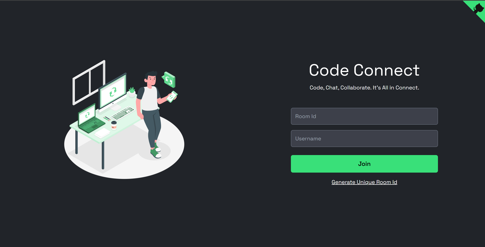

# Code Connect - A Realtime Code Editor



Code Connect is a collaborative, real-time code editor where users can seamlessly code together. It provides a platform for multiple users to enter a room, share a unique room ID, and collaborate on code simultaneously.

## 🔮 Features

- 💻 Real-time collaboration on code editing across multiple files
- 📁 Open, edit, save, and delete file functionalities
- 💾 Option to download files edited within the collaboration session
- 🚀 Unique room generation with room ID for collaboration
- 🌍 Comprehensive language support for versatile programming
- 🌈 Syntax highlighting for various file types with auto-language detection
- 🚀 Code Execution: Users can execute the code directly within the collaboration environment, providing instant feedback and results.
- ⏱️ Instant updates and synchronization of code changes across all files
- 📣 Notifications for user join and leave events
- 👥 User presence list of users currently in the collaboration session, including online/offline status indicators
- 💬 Group chatting allows users to communicate in real-time while working on code.
- 🎩 Real-time tooltip displaying users currently editing
- 💡 Auto suggestion based on programming language
- 🔠 Option to change font size and font family
- 🎨 Multiple themes for personalized coding experience
- 🎨 Collaborative Drawing: Enable users to draw and sketch collaboratively in real-time, enhancing the interactive experience of your project.

## 🚀 Live Preview

You can view the live preview of the project [here](https://code-connect-two-ivory.vercel.app/).

## 💻 Tech Stack


<details>
    <summary>
        <h2>📂 Folder Structure</h2>
    </summary>

```
client/
├── public/
│   ├── favicon/
│   │   └── ...
├── src/
│   ├── api/
│   │   └── index.jsx
│   ├── assets/
│   │   └── ...
│   ├── components/
│   │   ├── chats/
│   │   │   ├── ChatInput.jsx
│   │   │   └── ChatList.jsx
│   │   ├── common/
│   │   │   ├── Users.jsx
│   │   │   ├── Footer.jsx
│   │   │   └── Select.jsx
│   │   ├── connection/
│   │   │   └── ConnectionStatusPage.jsx
│   │   ├── drawing/
│   │   │   └── DrawingEditor.jsx
│   │   ├── editor/
│   │   │   ├── tooltip.js
│   │   │   ├── Editor.jsx
│   │   │   └── EditorComponent.jsx
│   │   ├── files/
│   │   │   ├── FileEditor.jsx
│   │   │   └── FileSystem.jsx
│   │   ├── loading/
│   │   │   └── Loading.jsx
│   │   ├── sidebar/
│   │   │   └── Sidebar.jsx
│   │   ├── tabs/
│   │   │   ├── ChatsTab.jsx
│   │   │   ├── UsersTab.jsx
│   │   │   ├── FileTab.jsx
│   │   │   ├── RunTab.jsx
│   │   │   ├── SettingsTab.jsx
│   │   │   └── TabButton.jsx
│   │   ├── toast/
│   │   │   └── Toast.jsx
│   │   ├── GitHubCorner.jsx
│   │   └── SplitterComponent.jsx
│   ├── context/
│   │   ├── AppContext.jsx
│   │   ├── AppProvider.jsx
│   │   ├── ChatContext.jsx
│   │   ├── FileContext.jsx
│   │   ├── RunContext.jsx
│   │   ├── SettingContext.jsx
│   │   ├── SocketContext.jsx
│   │   └── TabContext.jsx
│   ├── hooks/
│   │   ├── useAppContext.jsx
│   │   ├── useChatRoom.jsx
│   │   ├── useFileSystem.jsx
│   │   ├── useFullScreen.jsx
│   │   ├── useLocalStorage.jsx
│   │   ├── usePageEvents.jsx
│   │   ├── useResponsive.jsx
│   │   ├── useRunCode.jsx
│   │   ├── useSetting.jsx
│   │   ├── useSocket.jsx
│   │   ├── useTab.jsx
│   │   ├── useUserActivity.jsx
│   │   └── useWindowDimensions.jsx
│   ├── pages/
│   │   ├── EditorPage.jsx
│   │   └── HomePage.jsx
│   ├── resources/
│   │   ├── Font.js
│   │   └── Themes.js
│   ├── socket/
│   │   └── socket.js
│   ├── utils/
│   │   ├── actions.js
│   │   ├── editorPlaceholder.js
│   │   ├── formateDate.js
│   │   ├── initialFile.js
│   │   ├── getIconClassName.js
│   │   ├── status.js
│   │   └── tabs.js
│   ├── App.jsx
│   ├── index.css
│   └── main.jsx
├── .env
├── .eslintrc.cjs
├── .gitignore
├── index.html
├── package-lock.json
├── package.json
├── postcss.config.js
├── tailwind.config.js
└── vercel.json
└── vite.config.js

server/
├── utils/
│   └── actions.js
├── .env
├── .gitignore
├── package-lock.json
├── package.json
└── server.js

CONTRIBUTING.md
LICENSE
preview.png
README.md
```

</details>

## ⚙️ Installation

1. **Fork this repository:** Click the Fork button located in the top-right corner of this page to fork the repository.
2. **Clone the repository:**
   ```bash
   git clone https://github.com/Codename-shaShank/Code-connect.git
   ```
3. **Set .env file:**
   Inside the client and server directory, create or edit the .env file and add the following line:  
   Frontend:

   ```bash
   VITE_BACKEND_URL=<your_server_url>
   ```

   Backend:

   ```bash
   PORT=3000
   ```

4. **Install dependencies:**
   Navigate to the frontend and backend directories separately and run:
   ```bash
    npm install
   ```
5. **Start the frontend and backend servers:**  
   Frontend:
   ```bash
   cd client
   npm run dev
   ```
   Backend:
   ```bash
   cd server
   npm run dev
   ```
6. **Access the application:**
   Open a browser and enter the following URL:
   ```bash
   http://localhost:5173/
   ```
# code-connecter
# code-connecter-1
